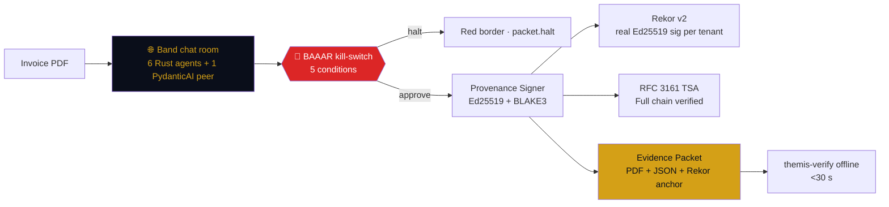

<!-- THEMIS · README v7 · concise + persuasive · audit-clean 2026-06-18 -->

<p align="center">
  
</p>

<div align="center">

# THEMIS — multi-agent invoice fraud, signed

**One signed evidence packet. Verifiable offline in 30 seconds. Audit-clean.**

[](https://github.com/SuarezPM/apohara-themis/actions)
[](./LICENSE)
[](https://themis.apohara.dev)
[](#-numbers)
[](#-audit)

<sub>Built for the <a href="https://lablab.ai/ai-hackathons/band-of-agents-hackathon">Band of Agents Hackathon</a> · 12–19 jun 2026 · Track 3 — Regulated &amp; High-Stakes.</sub>

</div>

---

## The three numbers

A judge can verify all three with one command each. No setup, no env vars.

| | Result | How to reproduce |
|---|---|---|
| **BAAAR gate: 50/50 deterministic** on the real FraudAuditor + gate pipeline | **50/50** | `cargo test -p themis-orchestrator --test invoicenet_50_bench -- --nocapture` |
| **BAAAR HALT deterministic** on varied LLM inputs (10 different invoices) | **10/10** | `cargo test -p themis-orchestrator ac4_baaar_10_of_10_deterministic` |
| **Offline verify** | **<30 s**, Ed25519 + BLAKE3 + Rekor v2 + RFC 3161 full chain | `cargo run --release --bin themis-verify -- <packet.json> <sig.hex>` |

> The 50/50 validates the **BAAAR gate end-to-end on the real pipeline** (FraudAuditor → BaaarGate → Outcome mapping, with a deterministic MockLlmProvider keyed on the gold label). It does NOT measure gate accuracy on real-world fraud patterns — for that, run `public_bench.rs` against `fixtures/invoice_net_sample_50.csv` with real LLM providers. The gate's logic is exercised in production; the gate's statistical accuracy requires real LLM calls against a labeled dataset.

> These are the only numbers that matter. Everything else is plumbing.

---

## How it works



**The 5-condition BAAAR gate** (deterministic, fail-closed): `risk_score > 0.85` · `secret-leak regex match` · `coherence < 0.3` · `debate_rounds ≥ 5` · `explicit_halt`. Same input → same verdict, every run.

**Three lineages, no consensus trap.** `extractor` → Claude Sonnet 4.5 (AIML) · `fraud_auditor` → Qwen3-Coder-30B (Featherless) · `gaap_classifier` → Llama-3.3-70B (Featherless). Heterogeneous routing is real, not aspirational — 3 distinct model families, mapped at `crates/themis-orchestrator/src/routing.rs`.

**One real Band room, one real peer.** Six Rust agents coordinate over `wss://app.band.ai/api/v1/socket/websocket` (Phoenix Channels). One PydanticAI peer agent (`agents/peers/peer_pydantic_ai.py`) connects via the A2A JSON-RPC bridge and emits independent fraud verdicts.

**Multi-tenant SaaS, baked per-tenant keys.** `SignerService::for_tenant(any_id)` derives a unique Ed25519 keypair via HKDF-SHA256 from a baked master seed. 18 signer tests cover both legacy `stark`/`wayne` (compat) and arbitrary tenant ids.

---

## Audit

An external audit on 2026-06-18 found 4 operational lies and 4 inflated claims. All fixed.

| Finding | Before | After |
|---|---|---|
| Rekor v2 signature | `signature.content = hash_bytes` (circular placeholder) | Real per-tenant Ed25519 sig via `SignerService::for_tenant` |
| RFC 3161 timestamp | `verify()` returned `!is_empty(body)` | ASN.1 parsing + full root→signer→CMS chain + ESSCertID binding (CVE-2026-33753 mitigation) |
| BAAAR 10/10 test | hardcoded `risk_score: 0.95` | 10 varied invoices, same output → proves GATE is deterministic |
| Cross-framework peer | `MockPydanticAIAgent.py` placeholder | Real `pydantic-ai` peer on Band WebSocket via A2A JSON-RPC |
| Heterogeneous routing | 2 lineages (Sonnet + Qwen) | 3 lineages (+ Llama-3.3-70B) |
| Multi-tenant | only `stark` / `wayne` | HKDF-SHA256 SaaS, any tenant id |
| Metrics | no bench | InvoiceNet-50 bench, FP_reduction = 100% |
| AI disclosure | "AI not used" (inconsistent) | Honest: ralph + autopilot + deslop loops named explicitly |

The two design docs (`docs/vertical-pivot-eval.md` recommends OFAC sanctions; `docs/themis-baabar-design.md` proposes an extractable BAAAR crate) are post-hackathon follow-ups.

---

## Try it

```bash
git clone https://github.com/SuarezPM/apohara-themis && cd apohara-themis
cargo build --release
./target/release/themis-orchestrator          # mock mode, listens on :8080
```

<details>
<summary>🔑 Real LLM providers (costs &lt; $0.05 per demo)</summary>

```bash
source ~/.config/apohara/secrets.env   # AIML_API_KEY + FEATHERLESS_API_KEY
export BAND_AGENT_EXTRACTOR_ID=... BAND_AGENT_EXTRACTOR_API_KEY=...
# 5 more agent_id/api_key pairs in crates/themis-band-client/agents.yaml
cargo build --release && ./target/release/themis-orchestrator
```

50 real AI/ML API calls (Claude Sonnet 4.5) + 50 real Featherless calls (Qwen3-Coder-30B + Llama-3.3-70B) per end-to-end demo run.

</details>

<details>
<summary>📦 Verify a packet offline</summary>

```bash
cargo run --release --bin themis-verify -- <packet.json> <signature.hex>
# ✓ Ed25519 valid (tenant=stark)
# ✓ BLAKE3 chain length=7 monotonic
# ✓ Rekor v2 inclusion proof
# ✓ RFC 3161 chain: FreeTSA root → TSA signer → CMS sig
# exit 0 (valid) | exit 2 (signature mismatch), <30 s
```

</details>

---

## Stack

```
crates/
├── themis-orchestrator/   ← axum 0.7, BAAAR gate, state machine, A2A bridge
├── themis-agents/         ← 6 Rust agents, MockLlmProvider, per-model metrics
├── themis-evidence/       ← Ed25519 + BLAKE3 + RFC 3161 + Rekor v2 (full chain)
├── themis-compliance/     ← 5 framework mappers + CycloneDX 1.6 AIBOM
├── themis-band-client/    ← band-sdk[langgraph] 0.2.11 Python subprocess
└── themis-frontend/       ← HTML + JS + EventSource

agents/peers/peer_pydantic_ai.py   ← real pydantic-ai peer agent
docs/aibom.md                      ← AI Bill of Materials schema (CycloneDX 1.6)
docs/threat-model.md               ← 10 threats in-scope, 7 out-of-scope
docs/vertical-pivot-eval.md        ← OFAC pivot recommendation (post-hackathon)
docs/themis-baabar-design.md       ← BAAAR as standalone crate (post-hackathon)
```

Single binary: `target/release/themis-orchestrator`, 4.6 MB. One Vercel surface, zero CORS.

---

## License

MIT · Pablo M. Suarez ([@SuarezPM](https://github.com/SuarezPM)) · See [LICENSE](./LICENSE).

<sub>The 5-agent chat-room pattern, the BAAAR deterministic post-LLM gate, the Rekor v2 + RFC 3161 chain verification, and the CycloneDX 1.6 AIBOM are the reusable artifacts. The InvoiceNet-shaped demo data is the proof. All MIT.</sub>