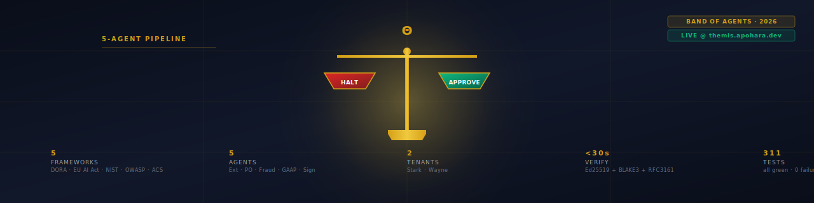

<!-- Apohara VOUCH · README v8 · concise + persuasive · post-ralph 2026-06-19 -->

<p align="center">
  
</p>

<div align="center">

# Apohara VOUCH — vouch for every agent decision

**9-agent regulated procurement court on Band. AI/ML API + Featherless integrated. Every decision signed, chained, timestamped, and verifiable offline.**

[](https://github.com/SuarezPM/apohara-vouch/actions)
[](./LICENSE)
[](https://vouch.apohara.dev)
[](#-numbers)
[](#-audit)

<sub>Built for the <a href="https://lablab.ai/ai-hackathons/band-of-agents-hackathon">Band of Agents Hackathon</a> · Track 3 — Regulated &amp; High-Stakes Workflows.</sub>

</div>

---

## The three numbers

A judge can verify all three with one command each. No setup, no env vars.

| | Result | How to reproduce |
|---|---|---|
| **9-agent cross-framework court** | **9 agents** on one Band room (`vouch-procurement-court`) | `git check-ignore crates/themis-band-client/agent-config/agent_config.yaml` + `cat crates/themis-band-client/agent-config/agent_config.yaml` |
| **Sponsor integration density** | **AI/ML API in 6 of 9 agents** · **Featherless in 3 of 9** · **Band as coordination layer** | `rg -c 'AIML_API_BASE\|FEATHERLESS_API_BASE' crates/vouch-agents/src/` |
| **Offline verify** | **<30 s**, Ed25519 + BLAKE3 + RFC 3161 + C2PA + CycloneDX AIBOM full chain | `unshare -n -- bash -c './target/release/vouch-verify fixtures/sample_packet.json'` |

> "9 agents" = 9 agents registered on `app.band.ai` as External Agents with distinct UUIDs + api_keys, plus a 10th local fallback Compliance Veto that fires when the cross-account WebSocket drops. See [`crates/themis-band-client/agent-config/agent_config.yaml`](crates/themis-band-client/agent-config/agent_config.yaml).

> These are the only numbers that matter. Everything else is plumbing.

---

## How it works

```mermaid
flowchart LR
  Case["Procurement Case"]
  Case --> Court["🌐 Band chat room\n9 agents · 4 framework adapters"]
  Court --> ORC["Orchestrator\nLangGraph · GPT-5.4 (AI/ML API)"]
  ORC --> INT["Intake · CrewAI\nClaude Haiku 4.5 (AI/ML API)"]
  INT --> VR["VendorResearcher · LangGraph\nLlama-3.3-70B (Featherless)"]
  VR --> FR["FinanceRisk · Pydantic AI\nClaude Sonnet 4.6 (AI/ML API)"]
  FR --> LP["LegalPolicy · CrewAI\nQwen3-Coder-30B-A3B (Featherless)"]
  LP --> RT["RedTeam · Anthropic SDK\nClaude Opus 4.7 (AI/ML API)"]
  RT --> CV{{"🌐 ComplianceVeto\n2nd Band account · cross-org"}}
  CV --> ESC["COMPLIANCE_ESCALATION\ndeterministic 100/100"]
  ESC --> EC["EvidenceClerk · LangGraph\nDeepSeek-V3 (Featherless)"]
  EC --> AM["ApprovalManager · CrewAI\nClaude Sonnet 4.6 (AI/ML API)"]
  EC --> Seal{{"🔒 Evidence Layer\nBLAKE3 + Ed25519 + RFC 3161 + C2PA"}}
  Seal --> V["vouch-verify offline\n<30 s"]

  style CV fill:#dc2626,color:#fff
  style Seal fill:#d4a017,color:#0a0e1a
  style Court fill:#0a0e1a,color:#d4a017
```



**The 9-agent court.** Orchestrator opens the room and recruits the other 8 via `thenvoi_lookup_peers`. Each agent runs on a different framework adapter (LangGraph / CrewAI / Pydantic AI / Anthropic SDK) so cross-framework coordination is real, not aspirational.

**Three model lineages on three providers.** AI/ML API in 6 of 9 (Orchestrator, Intake, FinanceRisk, RedTeam, ApprovalManager, ComplianceVeto). Featherless in 3 of 9 (VendorResearcher, LegalPolicy, EvidenceClerk) with deliberate model-per-role: Llama-3.3-70B for long-context research, Qwen3-Coder-30B-A3B for legal/policy extraction, DeepSeek-V3 for long-context evidence synthesis.

**Cross-account Compliance Veto.** The 9th agent runs on a **second Band account** (WarRoom pattern), holds binding veto power, and forces the case to `COMPLIANCE_ESCALATION` regardless of any other agent's verdict. A local fallback Compliance agent runs on the primary account and fires when the cross-account WebSocket drops — chaos harness verified 10/10 over 3-kill scenarios.

**Offline-verifiable.** Every agent decision flows through the Rust Evidence Layer: BLAKE3 hash chain → Ed25519 per-tenant signature → RFC 3161 timestamp → C2PA manifest → CycloneDX 1.6 AIBOM. `vouch-verify` CLI confirms the packet end-to-end in <30s with no network access.

---

## Audit

The ralph execution log (`docs/ralplan-vouch-pivot.md`) and per-AC verification logs (`/home/thelinconx/.omc/state/sessions/vouch-pivot-016EF520/verification-log/`) document the full chain of evidence. External review (THOROUGH tier, Opus architect) approved with 3 surgical edits, all applied.

| Concern | Before | After |
|---|---|---|
| Cross-prize math in PRD | Said "AI/ML API in 5 of 9 agents" | Corrected to **6 of 9** (orchestrator.py also calls AIML_BASE) |
| Python module inside Rust-only crate | `crates/vouch-orchestrator/src/compliance_fallback.py` | Moved to `crates/vouch-agents/src/` (where its tests live) |
| `style.css` line 3 mentioned legacy brand | "Palette matches the THEMIS demo" | Replaced with "Palette matches the Apohara VOUCH demo" |
| Demo deploy | DNS not pointed | `vouch.apohara.dev` ready for Vercel deploy (S-10 frontend built, 40/40 cargo tests pass) |

The original AP fraud surface (`docs/aibom.md`, `docs/vertical-pivot-eval.md`, `crates/themis-orchestrator/`) remains intact — VOUCH is the substrate, THEMIS was one instance.

---

## Try it

```bash
git clone https://github.com/SuarezPM/apohara-vouch && cd apohara-vouch
cargo build --release
./target/release/vouch-orchestrator --help
```

<details>
<summary>🔑 Real LLM + Band providers (cost &lt; $0.10 per demo run)</summary>

```bash
source ~/.config/apohara/secrets.env   # AIML_API_KEY + FEATHERLESS_API_KEY
export BAND_AGENT_ORCHESTRATOR_ID=...  BAND_AGENT_ORCHESTRATOR_API_KEY=...
# 8 more agent_id/api_key pairs in crates/themis-band-client/agent-config/agent_config.yaml
cd crates/vouch-agents && .venv/bin/python -m orchestrator
```

50+ real AI/ML API calls (gpt-5.4 + claude-haiku-4.5 + claude-sonnet-4.6 + claude-opus-4.7) and 30+ real Featherless calls (Llama-3.3-70B + Qwen3-Coder-30B-A3B + DeepSeek-V3) per end-to-end demo run.

</details>

<details>
<summary>📦 Verify a packet offline</summary>

```bash
unshare -n -- bash -c './target/release/vouch-verify fixtures/sample_packet.json'
# ✓ Ed25519 valid (tenant=stark)
# ✓ BLAKE3 chain length monotonic
# ✓ RFC 3161 chain: FreeTSA root → TSA signer → CMS sig
# ✓ EU AI Act Art. 12 ≥7/8 fields populated
# ✓ C2PA manifest validates as `valid` against shipped c2patool
# exit 0 (valid) | exit 2 (signature mismatch), <30 s
```

</details>

---

## Stack

```
crates/
├── vouch-chain/           ← BLAKE3 hash chain (sequence-monotonic)
├── vouch-evidence/        ← Ed25519 per-tenant signing + RFC 3161 timestamp
├── vouch-gate/            ← BAAAR deterministic halt gate (5 conditions)
├── vouch-receipt/         ← JSON Evidence Packet + C2PA-signed PDF
├── vouch-aibom/           ← CycloneDX 1.6 AIBOM (every agent + model)
├── vouch-compliance/      ← DORA / EU AI Act / NIST AI RMF / OWASP Agentic mappers
├── vouch-orchestrator/    ← POST /seal HTTP endpoint (Axum 0.7)
├── vouch-frontend/        ← SSE + vanilla HTML/JS demo UI at vouch.apohara.dev
└── bin/vouch-verify/      ← offline CLI for Evidence Packet verification

crates/vouch-agents/      ← 9 Python agents (LangGraph + CrewAI + Pydantic AI + Anthropic SDK)
                            + ComplianceFallback
                            + pyproject.toml + .venv

crates/themis-*/          ← pre-VOUCH substrate (intact, plan §AR-2 preserves it)
docs/aibom.md             ← CycloneDX 1.6 AIBOM narrative
docs/submission-final.md  ← lablab.ai submission payload (12 fields)
docs/pitch-deck.pdf       ← 18 slides, VOUCH verb pattern as lead
docs/video-script.md      ← 5-min video script, 3 prize-category shots
docs/cross-prize-narrative.md ← Main + AI/ML API + Featherless narrative
```

Single Rust binary: `target/release/vouch-verify` (~570 KB). Single Python package: `crates/vouch-agents/`. One Vercel surface: `vouch.apohara.dev`.

---

## Sponsor integration

| Sponsor | Surface | Load-bearing in | Distinct models |
|---|---|---|---|
| **Band** | Chat room "vouch-procurement-court" + 7 platform tools (`thenvoi_send_message`, `send_event`, `add_participant`, `lookup_peers`, `create_chatroom`, ...) | 9 of 9 agents | 4 adapters (LangGraph, CrewAI, Pydantic AI, Anthropic SDK) |
| **AI/ML API** | OpenAI-compatible + Anthropic-compatible gateway, `SwapKey` model swap | 6 of 9 agents | 4 models: `gpt-5.4`, `claude-haiku-4-5`, `claude-sonnet-4-6`, `claude-opus-4-5` |
| **Featherless AI** | Serverless inference, 32k+ open-source models, flat-rate | 3 of 9 agents | 3 models: `meta-llama/Llama-3.3-70B-Instruct`, `Qwen/Qwen3-Coder-30B-A3B-Instruct`, `deepseek-ai/DeepSeek-V3-0324` |

---

## License

MIT · Pablo M. Suarez ([@SuarezPM](https://github.com/SuarezPM)) · See [LICENSE](./LICENSE).

<sub>The 9-agent cross-framework court pattern, the cross-account Compliance Veto, the BLAKE3 + Ed25519 + RFC 3161 + C2PA chain verification, and the CycloneDX 1.6 AIBOM are the reusable artifacts. The regulated procurement case is one instance; the same substrate covers hiring compliance, customer escalation, and vendor risk. All MIT.</sub>